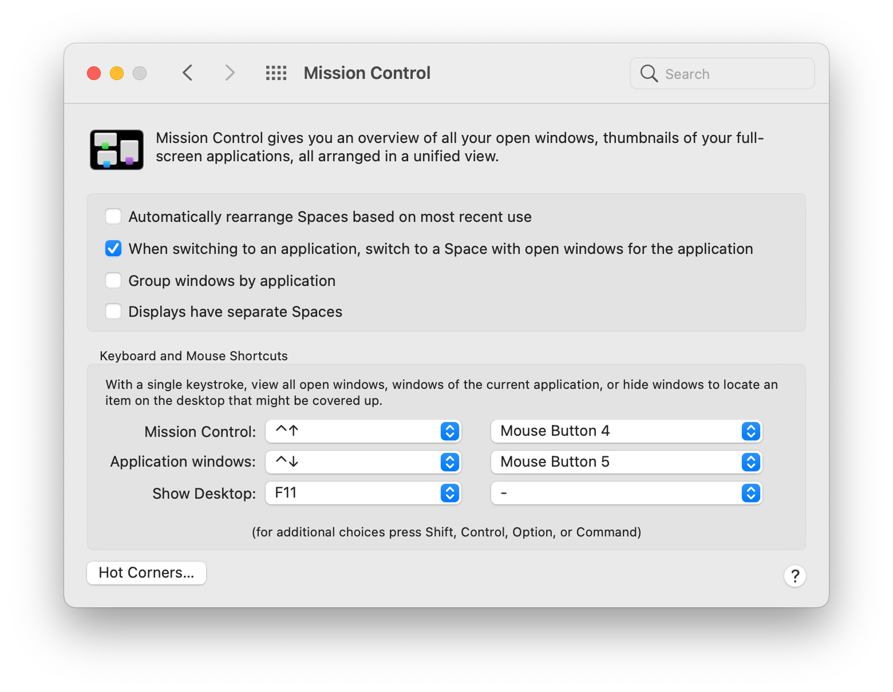

# Dotfiles

This repository contains my dotfiles.

## Manual Setup

This section contains everything that needs to be set up manually after the
automated setup runs. Most of this could be automated in the future, but for now
it's manual.

### Mouse Button Setup

Newer versions of macOS [no longer require third party tools](https://superuser.com/a/1636028)
to assign Mission Control to extra mouse buttons. For the Alienware mouse, the
configuration is below.



### NeoVim + iTerm2

There seems to be an issue with Neovim and `C-h` overriding to move between
split windows in Neovim. This turned out to be a iTerm2 + 256 colour issue.
There's a long issue on the Neovim repo with [this comment being the
solution](https://github.com/neovim/neovim/issues/2048#issuecomment-78045837).

```
infocmp $TERM | sed 's/kbs=^[hH]/kbs=\\177/' > $TERM.ti
tic $TERM.ti
```

This is a one time setup.
